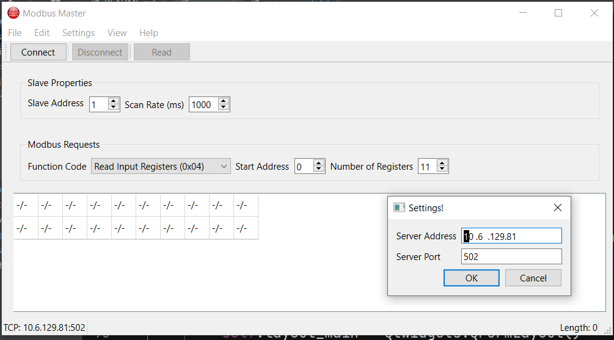

# Modbus TCP Master Simulator Using QT for Python
This an implementation of a Modbus TCP master Simulator. This simulator allows reading Registers from a TCP Server. The Simulator is implemented with Qt for Python using the pyside6 Library. 
There are 4 Function codes implemented for reading Registers
1. Function code 0x01 for reading Coils
2. Function code 0x02 for reading Input registers
3. Function code 0x03 fpr reading holding registers
4. Function code 0x04 for reading input registers

This is Version 1 for the simulator. The Final Version of this simulator is intended to be able to read and write Modbus registers using both TCP and Serial (Modbus RTU).
With the current Implementation, you can only read Registers. 

Continous polling is not yet implemented so is done by sending a single read command using the read button.

### Instructions 
- Make sure you have python and pip installed. It is recommeded that you have python version 2.7 or higher
- Install dependencies in the requirements.txt file by running ```pip install -r requirements.txt``` command
- Run the main script with the ```python main.py``` command

### Usage
- The simulator opens with one register to read by default. The Default Server address and port can slo be seen from the status bar


- You should modify the number of registers you wish to read. The register table below will update as you modify the ```Number of Registers``` parameter


- To configure you TCP server parameters, use the ```Settings``` menu



- Now you can attempt to connect to the server by clicking the connect button. If the connection fails, an error message will be displayed


- Correcting the Server ip or port and trying again will establish the connection. The ```Disconnect``` and ```Read``` will now be activated


- Make sure you have selected the correct function code and press the ```Read``` button. Data is displayed in the registers table below


### Using pyinstaller 
```pyinstaller -n "sModbusMaster" --noconsole --onefile --icon=modbus.ico main.py```
